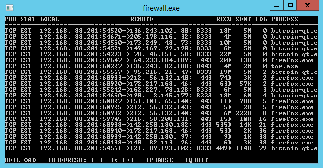

# firewall.exe v0.92

## Requirements:

  [WinDivert 2.2](https://www.reqrypt.org/windivert.html) (included)
  

## Instruction

1. Edit firewall tables

  * loopback.txt (Loopback rules)
  * out.txt (Outbound rules)
  * in.txt (Inbound rules)

  Rules are executed in sequential order.
  The sequence is terminated on a match,
  with one of the following actions:
.
      ACCEPT      - accept the connection and show activity
      ACCEPT_HIDE - accept the connection but hide activity
      DROP        - drops the packet silently

  If no match is found, the default is DROP.

  # precedes a comment
  * represents a wildcard
  IP Subnets are allowed in CIDR format eg. 192.168.0.0/24

1. Disable Windows Firewall

1. Start firewall.exe

## Known Limitations

* Ports are not validated and treated as strings.
    "001" not equals "1"
* Invalid action defaults to DROP

## Changes

### v0.92

* Fixed minor memory leak
* Added reload
* Added refresh interval
* Added pause refresh
* Added quit

## Upcoming

* More clean up
* Windows GUI
* Run as Windows Service
* Disable network while firewall is off
* Stress Testing
* Fix stability issue under extreme load
* Performance Tuning
  * enums instead of strings
  * switch (enum)
  * store ip addresses and subnet masks in binary